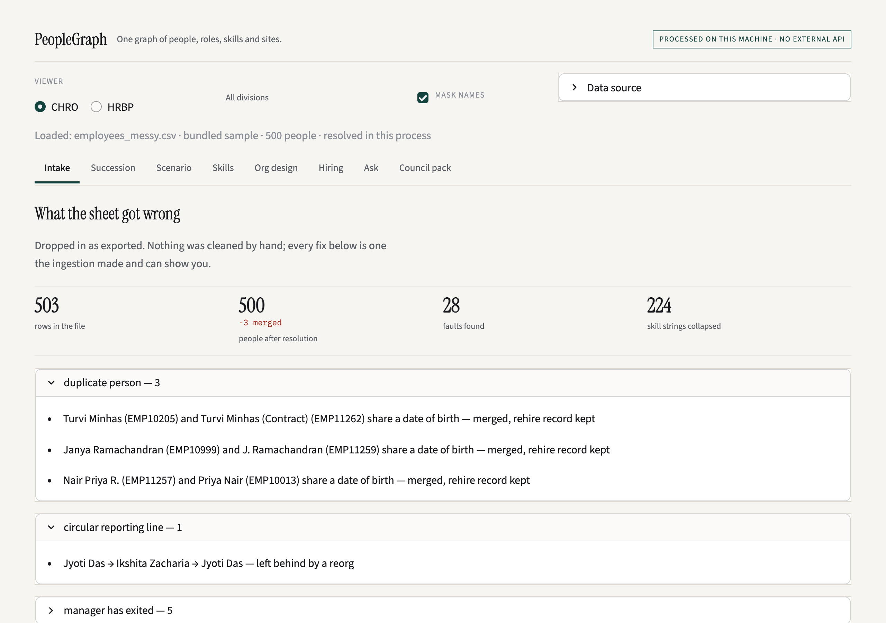
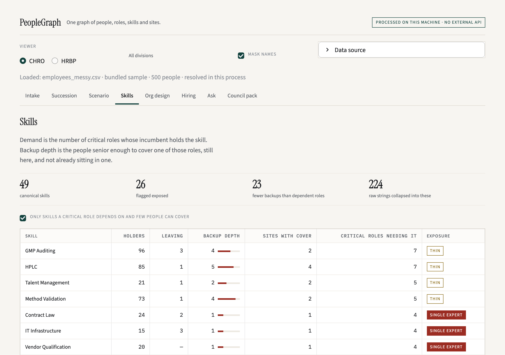
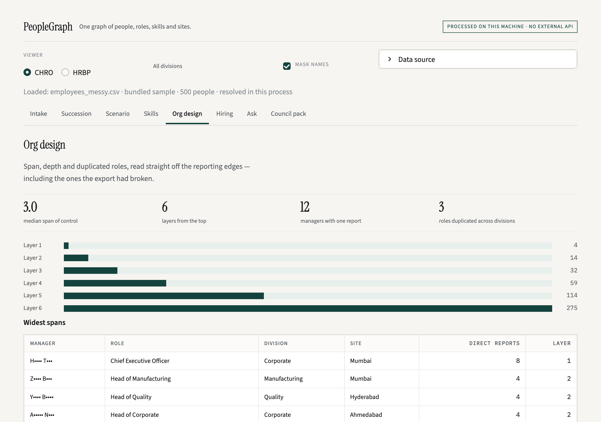

# PeopleGraph

Turn the employee export your HRIS actually produces into something you can
reason about. PeopleGraph reads a messy sheet, fixes it on the way in and
tells you every fix it made, builds a graph of people, roles, skills and sites,
and charts the organisation from it — spans, layers, duplicated roles, where
skills are thin.

It runs on your own machine. Nothing is uploaded and there is no external API.



## Why

Every people-analytics question starts with the same afternoon of cleaning:
the same person entered twice after a rehire, a reporting loop left by a
reorg, managers who left in March, two grading systems in one sheet, five
spellings of one skill. PeopleGraph does that afternoon in a second and shows
its work, so the numbers downstream can be trusted and argued with.

## Quickstart

Python 3.9 or later.

```bash
git clone https://github.com/shashi-shekhar-25/peoplegraph
cd peoplegraph
python3 -m venv .venv
.venv/bin/pip install -r requirements.txt
.venv/bin/streamlit run app.py
```

On Windows, use `.venv\Scripts\pip` and `.venv\Scripts\streamlit`.

The app opens on a bundled synthetic export. Use **Data source** to drop in
your own CSV.

Check everything works:

```bash
.venv/bin/python test_peoplegraph.py && .venv/bin/python test_ml.py
```

## What it does

| Module | What you get |
| --- | --- |
| **Intake** | Rows in, people out, and every fault found: duplicate people merged (same date of birth, fuzzy name), circular reporting lines broken, managers not on the roster, managers who have exited, blank divisions inferred from the manager, legacy grades and potential scales mapped, skill spellings collapsed. The resolved roster. |
| **Skills** | Supply against demand: holders, who is leaving, backup depth (people senior enough to cover a critical role), sites, and where cover is a single expert or on one site. |
| **Org design** | Median span of control, layers from the top, managers with one report, the same title across divisions. |
| **Nine-box** | Calibrated rating against recorded potential, straight from the sheet. |
| **Retention check-ins** | A logistic-regression model trained on your own leavers of the last 12 months, in this process. Who looks most like them now, the reasons in words, a first step for each, and a likely range of leavers next year. It refuses when there are fewer than 30 leavers or when it tests too weak on held-out people, and it never uses date of birth, gender, name or email (`ml.py`). |
| **In plain words** | Intake and Retention check-ins each write a short summary from their own figures. With [Ollama](https://ollama.com/download) running, it can be translated into Hindi, Tamil, Telugu, Marathi, Bengali and more on your own machine; every number is checked against the English, and the English is shown if any changed. |
| **Ask** | Data-quality and headcount questions, through a local [Ollama](https://ollama.com) model if one is running, or a keyword fallback if not. Only `127.0.0.1` is contacted. |

| Skills: where cover is thin | Org design: spans and layers |
| --- | --- |
|  |  |

## Architecture

```
CSV export ──► load()            peoplegraph.py   pandas: aliases, dates, bands, skills
                 │  resolve      duplicates, cycles, orphans, exited managers, divisions
                 ▼
               Company           people table + NetworkX graph + DuckDB view
                 │               nodes: person, role, skill, location
                 │               edges: reports_to, holds_role, has_skill, based_at
                 ▼
     skills_report · org_design · nine_box · chain       (all read the same graph)
                 ▼
               app.py (Streamlit) · nlq.py (question → intent → answer)
```

| File | What's in it |
| --- | --- |
| `peoplegraph.py` | Ingest, entity resolution, the graph, skills supply, org design, nine-box |
| `ml.py` | The retention model: frame, fit, held-out accuracy, reasons, plain-words summary |
| `nlq.py` | Question → intent (local model or keyword fallback) → answer; translation of summaries |
| `app.py`, `ui.py` | The Streamlit app and its design system |
| `generate_data.py` | The synthetic sample, faults seeded on purpose |
| `test_peoplegraph.py`, `test_ml.py` | Runnable checks: the pipeline, and the model learns a real pattern and refuses a shuffled one |
| `DESIGN.md` | The design contract the UI follows |

## The sample dataset

`data/employees_messy.csv` is 575 rows: 498 synthetic employees of a
made-up pharma company and the 74 who left in the last year, generated with Faker by `generate_data.py`. No real
person or employer is in it. It carries the faults a real export has, on
purpose: three duplicate people, a reporting loop, five people reporting to a
manager who has exited, a manager code that is not on the roster, fourteen blank divisions, a legacy
grading system and a legacy potential scale, and 224 skill strings that
collapse to 49 skills. Regenerate it with `python generate_data.py`.

## Your data

- Everything runs in the Python process on your machine. The file you load is
  read into memory and not written anywhere.
- Streamlit's usage statistics are switched off in `.streamlit/config.toml`.
- Fonts are served locally; the app makes no request to a CDN.
- The only network call is to a local Ollama server on `127.0.0.1`: a check
  for a model, your question if a model is running, and a summary you ask to
  translate (figures only, no names). Nothing is sent anywhere else.
- Names are masked by default, and revealing one is logged in the session's
  audit panel.
- `.gitignore` refuses anything in `data/` except the synthetic sample. Please
  do not open issues with real employee data.

## Limitations

- CSV in, one row per person. Column names are matched from a fixed alias list
  (`COLUMN_ALIASES` in `peoplegraph.py`); extend it for your HRIS.
- Critical roles are spotted from title patterns tuned to the sample
  (`CRITICAL_PATTERNS`); change them for your organisation.
- Two grading systems are hard-coded in `BAND_LEVELS`.
- Skills aliases are a starter list, not an ontology.
- It holds one export at a time. There is no history, no users, no connectors.

## Roadmap

- Column mapping from the UI instead of the alias list
- Band order from the UI
- .xlsx input
- Export of the resolved roster and the fault list

## Toolkits: the paid, no-install versions

This repository cleans the export and charts the organisation. Five toolkits
do the finished job on your own export, in a browser, with nothing to install
and nothing uploaded: **Succession** (scored benches, readiness tiers,
flight-risk reasons, council pack), **Org Chart** (eight designs, reorg
what-ifs, PowerPoint), **HR Analytics** (headcount, attrition, tenure,
diversity), **Skills Intelligence** (inventory, critical-role cover, skills
matrix) and **Workforce Forecasting** (headcount and capability one to five
years out). [peoplegraph.co.in/toolkits](https://peoplegraph.co.in/toolkits)

## Enterprise

For a continuously maintained intelligence layer across the whole workforce —
HRIS connectors, your own role architecture and skills vocabulary, multi-user
access, governance and audit, deployed inside your walls — see
[peoplegraph.co.in/enterprise](https://peoplegraph.co.in/enterprise).

## Contributing and security

See [CONTRIBUTING.md](CONTRIBUTING.md) and [SECURITY.md](SECURITY.md).

## Licence

Apache License 2.0 — see [LICENSE](LICENSE). The bundled fonts (IBM Plex Sans,
IBM Plex Mono, Instrument Serif) are under the SIL Open Font License 1.1; see
[static/fonts/OFL-NOTICES.txt](static/fonts/OFL-NOTICES.txt).
